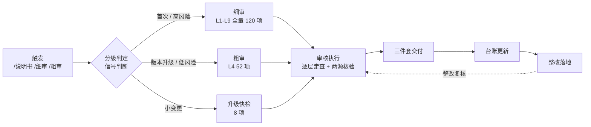
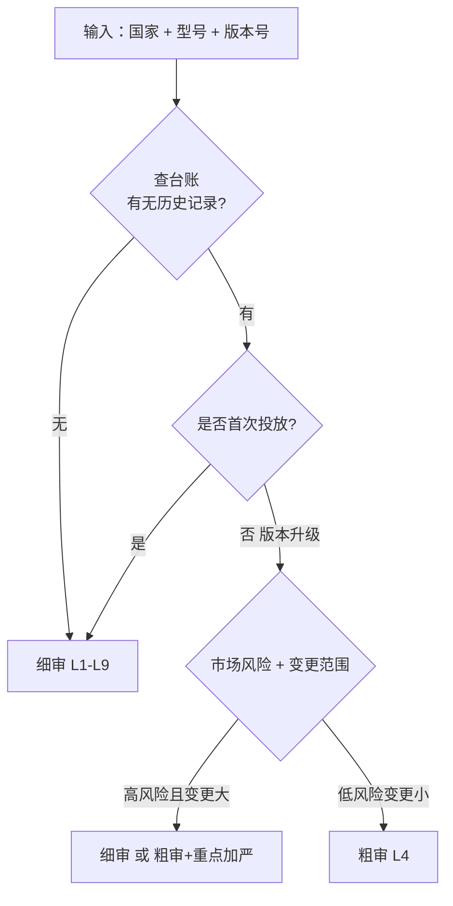
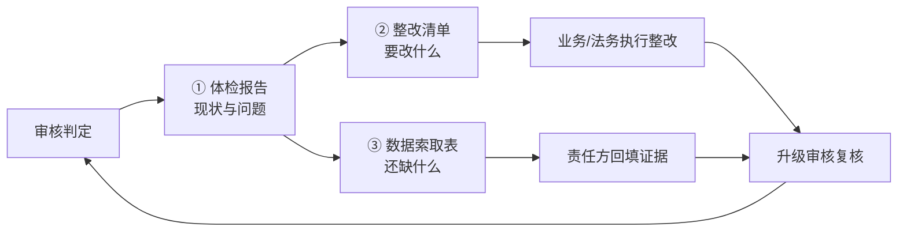

# 说明书审核 Skill · 运作链路与流程图

> **配套文档**：`说明书审核-skill说明书`（是什么）、`说明书审核清单-母版`（审什么）
> **本文件**：怎么跑起来的（运作链路 + 流程图）
> **版本**：v0.1（2026-08-08）

---

## 一、Skill 在合规体系中的位置

```
方法论（Obsidian）—— 四置换 · 三载体 · 两源核验
      │ 抽象为「审核对象」
      ▼
清单母版（唯一可编辑源）—— L1-L9 × 120 项 + 升级快检 8 项
      │ 导出 / 引用
      ▼
SKILL.md（触发规则 + 执行规则 + 交付规范）
      │ 每次审核
      ▼
三件套交付物 —— 体检报告 · 整改清单 · 数据索取表
      │ 落地
      ▼
整改闭环 —— 台账 · 复核 · 版本迭代
```

**三层分工**：母版管「审什么」（可维护清单），SKILL.md 管「怎么审」（流程规则），交付物管「审出什么」（可执行结果）。

---

## 二、总链路图（闭环）



**一句话链路**：触发 → 分级 → 审核 → 三件套交付 → 台账 → 整改 → 复核（回到审核，形成闭环）。

---

## 三、分级判定子流程（环节 2）



**信号来源**：国家/型号/版本从文件名解析；是否首次查台账；市场风险查风险分级表；变更范围（换认证/改责任主体/大改版）需向用户确认。

---

## 四、审核执行子流程（环节 3）

**细审**（首次审核）：按母版 L1-L9 逐层走查 120 项

```
L1 准入文件(15) → L2 产品实物(11) → L3 物理载体(8) → L4 说明书文本(52)
  → L5 经营主体(6) → L6 软件数据(8) → L7 受众文化(10) → L8 市场宣称(4) → L9 动态档案(6)
```

**粗审**（升级复核）：只走 L4 说明书文本层 52 项
**升级快检**：8 项（四置换复核/语言同步/失效信息/认证有效期/整改落地/DoC链接/儿童数据/法规时效）

**贯穿所有层**：两源核验——一手信源（法规原文/MCP/PDF 视觉）+ 间接信源（Notion/外网 ≥2 源）交叉；未经交叉验证不得作为确定义务。

---

## 五、三件套交付物流转（环节 4）



**三件套联动**：体检报告（分析）→ 整改清单（执行动作）→ 数据索取表（收集证据）；数据到位回填报告完成该层判定。

| # | 交付物 | 格式 | 回答的问题 |
|---|---|---|---|
| ① | 体检报告 | markdown / docx | 现状如何、哪里有问题 |
| ② | 整改清单 | excel · 16 列 · 每国一 sheet | 要改什么、依据什么 |
| ③ | 数据索取表 | excel · 按责任方 | 还缺什么数据、向谁要 |

---

## 六、资产引用关系（单源真相）

```
                    ┌─────────────────────────────┐
                    │  清单母版（唯一可编辑源）      │
                    │  L1-L9 × 120 项 + 维护规则    │
                    └──────────────┬──────────────┘
           导出 · 更新「子类/细项」│       引用「明细以母版为准」
        ┌─────────────────────────┼─────────────────────────┐
        ▼                         ▼                         ▼
 Excel 模板                  SKILL.md 索引              skill 说明书 / README
 首次审核清单 120 项           层级汇总表                 4.2 分层表 + 配套模板清单
        ▲
        │ 审核时填写
  审核执行 → 三件套
```

**规则**：子类/细项只改母版，再同步 Excel 与 SKILL.md 索引；禁止反向。台账与整改清单是每次审核的产出，不参与母版维护。

---

## 七、一次完整审核的时间线（示例：新设印尼首次准入）

| 步骤 | 动作 | 产物 |
|---|---|---|
| 1 | 触发 `/说明书细审`（印尼全部型号） | — |
| 2 | 分级判定：台账无记录 → 首次 → 细审 | 判定结论 |
| 3 | 按母版走 L1-L9 120 项，两源核验 | 逐层判定 |
| 4 | 出三件套 | 体检报告 + 整改清单（12 项）+ 数据索取表 |
| 5 | 更新台账 | 印尼 × 型号 × 细审 × 状态 |
| 6 | 业务/法务整改，责任方回填证据 | 整改记录 |
| 7 | 升级复核（复核整改落地） | 闭环 |

---

*本文件由 2026-08 全市场体检 + 印尼细审实战导出。*
